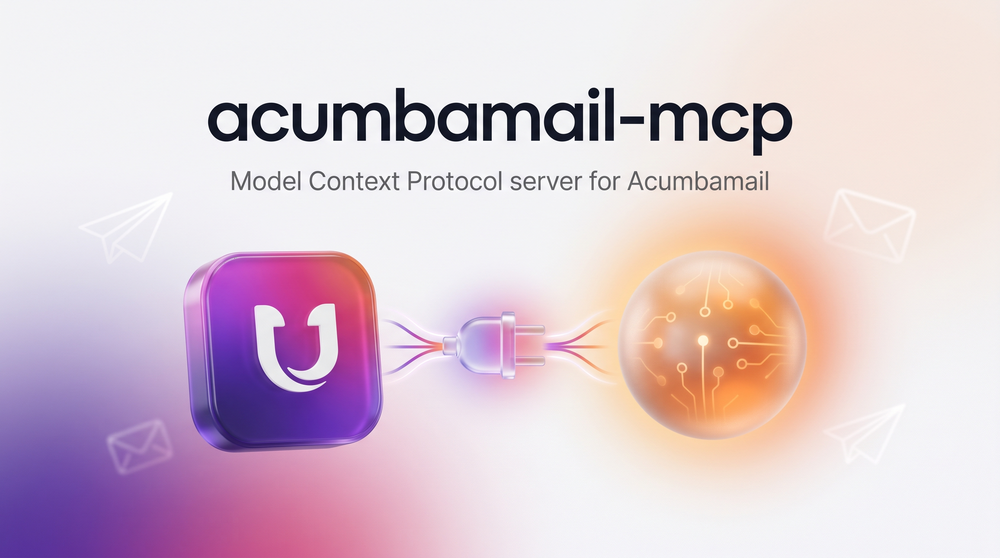

<p align="center">
  
</p>

<h1 align="center">acumbamail-mcp</h1>

<p align="center">
  Servidor <strong>MCP (Model Context Protocol)</strong> para <a href="https://acumbamail.com">Acumbamail</a>.<br>
  Gestiona listas, suscriptores, campañas, estadísticas y email transaccional desde tu agente (Claude, Cursor, etc.).
</p>

<p align="center">
  
  
  
  
</p>

---

> A junio de 2026 **no existía ningún servidor MCP nativo para Acumbamail** — solo wrappers genéricos (Pipedream) o nodos de automatización (n8n). Este es el primero dedicado: TypeScript sobre el SDK oficial de MCP, con salvaguardas pensadas para no enviar correo por accidente.

## Tabla de contenidos

- [¿Qué es esto?](#qué-es-esto)
- [Características](#características)
- [Cómo obtener tu API key de Acumbamail](#cómo-obtener-tu-api-key-de-acumbamail)
- [Instalación](#instalación)
- [Configuración del token](#configuración-del-token)
- [Registro en tu cliente MCP](#registro-en-tu-cliente-mcp)
- [Tools disponibles](#tools-disponibles)
- [Ejemplos de uso](#ejemplos-de-uso)
- [Seguridad](#seguridad)
- [Particularidades de la API (gotchas)](#particularidades-de-la-api-de-acumbamail-gotchas)
- [Desarrollo](#desarrollo)
- [Roadmap](#roadmap)
- [Aviso legal y de marca](#aviso-legal-y-de-marca)
- [Licencia](#licencia)

## ¿Qué es esto?

[Acumbamail](https://acumbamail.com) es una plataforma española de email marketing y SMS. Este proyecto expone su [API REST](https://acumbamail.com/apidoc/) como un **servidor MCP**, de modo que un asistente de IA compatible con el [Model Context Protocol](https://modelcontextprotocol.io) (Claude Desktop, Claude Code, Cursor, etc.) pueda operar tu cuenta con lenguaje natural: «lista mis campañas», «¿cuántos abrieron la última?», «da de alta estos contactos»…

## Características

- **25 tools** sobre la API de Acumbamail: listas, suscriptores, campañas, estadísticas y email transaccional.
- **Gates de confirmación** en toda acción peligrosa (`create_campaign`, `delete_list`, `delete_campaign`, `delete_subscriber`, `batch_delete_subscribers`): requieren `confirm: true` explícito. Sin él, la tool **describe el efecto y no actúa**.
- **Anti-envío accidental**: en Acumbamail `createCampaign` **envía la campaña de inmediato** (no hay borrador vía API). Por eso `acumbamail_create_campaign` exige confirmación y **rechaza** cualquier HTML sin el enlace de baja obligatorio `*|UNSUBSCRIBE_URL|*`.
- **Robusto**: reintentos con backoff exponencial ante rate-limit (429), timeout configurable, errores tipados.
- **Privado por diseño**: el token se lee **solo** de una variable de entorno; nunca se escribe en disco ni en el repositorio.

## Cómo obtener tu API key de Acumbamail

1. Crea una cuenta (o inicia sesión) en **[acumbamail.com](https://acumbamail.com)**. El plan gratuito ya incluye acceso a la API.
2. Con la sesión iniciada, abre la documentación de la API: **<https://acumbamail.com/apidoc/>**.
3. En esa página, estando logueado, verás tu **`auth_token`** personal en la sección de credenciales / ejemplos de petición. Es una cadena alfanumérica (tu token de cuenta).
4. **Cópialo y trátalo como una contraseña.** Da acceso completo a tu cuenta de email marketing.

> 🔑 El token es de cuenta (no caduca por sí solo). Si crees que se ha filtrado, regenéralo desde el panel de Acumbamail.

## Instalación

Requisitos: **Node.js ≥ 18**.

La forma más sencilla es no instalar nada: tu cliente MCP puede ejecutarlo con `npx` (ver [Registro](#registro-en-tu-cliente-mcp)).

Para desarrollo o ejecución local, clónalo y compílalo:

```bash
git clone https://github.com/mario-hernandez/acumbamail-mcp.git
cd acumbamail-mcp
npm install
npm run build
```

Esto compila a `dist/`. El binario es `dist/index.js`.

## Configuración del token

El servidor lee el token **solo** de la variable de entorno `ACUMBAMAIL_AUTH_TOKEN`. **Nunca** lo pongas en un archivo versionado.

Para pruebas locales puedes usar un `.env` (ya está en `.gitignore`):

```bash
cp .env.example .env
# edita .env y pega tu token en ACUMBAMAIL_AUTH_TOKEN
```

| Variable | Obligatoria | Por defecto | Descripción |
|---|---|---|---|
| `ACUMBAMAIL_AUTH_TOKEN` | ✅ | — | Tu token de la API de Acumbamail |
| `ACUMBAMAIL_TIMEOUT_MS` | ❌ | `30000` | Timeout de cada petición HTTP, en ms |
| `ACUMBAMAIL_DEBUG` | ❌ | — | Si `=1`, registra método + status HTTP por `stderr` (nunca el token ni los datos) |

## Registro en tu cliente MCP

### Claude Code

```bash
claude mcp add acumbamail \
  -e ACUMBAMAIL_AUTH_TOKEN="tu_token" \
  -- npx -y acumbamail-mcp
```

> 💡 **macOS — sin escribir el token en ningún sitio.** Guárdalo una vez en el Llavero y léelo en el momento del registro:
> ```bash
> # guardar (una vez)
> security add-generic-password -s acumbamail-api -a "$USER" -w "TU_TOKEN"
> # registrar leyéndolo del llavero
> claude mcp add acumbamail \
>   -e ACUMBAMAIL_AUTH_TOKEN="$(security find-generic-password -s acumbamail-api -w)" \
>   -- npx -y acumbamail-mcp
> ```

Comprueba con `claude mcp list` que aparece `acumbamail … ✓ Connected`.

### Claude Desktop / Cursor (config JSON)

En el archivo de configuración MCP de tu cliente:

```json
{
  "mcpServers": {
    "acumbamail": {
      "command": "npx",
      "args": ["-y", "acumbamail-mcp"],
      "env": { "ACUMBAMAIL_AUTH_TOKEN": "tu_token" }
    }
  }
}
```

> Para usar el código local en vez del paquete npm, sustituye `npx -y acumbamail-mcp` por `node /ruta/absoluta/a/acumbamail-mcp/dist/index.js` (o el `command`/`args` equivalentes en el JSON).

## Tools disponibles

🔒 = requiere `confirm: true` · ⚠️ = envío inmediato e irreversible

### Listas
| Tool | Descripción |
|---|---|
| `acumbamail_get_lists` | Lista todas las listas de la cuenta |
| `acumbamail_get_list_stats` | Estadísticas de una lista (totales, altas, bajas, bounces) |
| `acumbamail_create_list` | Crea una lista (datos de empresa obligatorios anti-spam) |
| `acumbamail_delete_list` 🔒 | Borra una lista y todos sus suscriptores |
| `acumbamail_get_fields` | Merge fields (columnas) de una lista |
| `acumbamail_add_merge_tag` | Añade una columna / merge tag a una lista |
| `acumbamail_get_forms` | Formularios de suscripción de una lista |

### Suscriptores
| Tool | Descripción |
|---|---|
| `acumbamail_get_subscribers` | Lista suscriptores (filtro por estado, paginable) |
| `acumbamail_get_subscriber_details` | Detalle de un suscriptor |
| `acumbamail_add_subscriber` | Alta de un suscriptor (con doble opt-in opcional) |
| `acumbamail_batch_add_subscribers` | Alta/actualización masiva — vía preferida para imports |
| `acumbamail_delete_subscriber` 🔒 | Borra un suscriptor |
| `acumbamail_batch_delete_subscribers` 🔒 | Borrado masivo |

### Campañas
| Tool | Descripción |
|---|---|
| `acumbamail_create_campaign` 🔒⚠️ | Crea y **ENVÍA** una campaña al instante (exige `*\|UNSUBSCRIBE_URL\|*`) |
| `acumbamail_get_campaigns` | Lista todas las campañas |
| `acumbamail_get_campaign_basic_information` | Info básica de una campaña |
| `acumbamail_get_campaign_total_information` | Estadísticas agregadas de una campaña |
| `acumbamail_get_campaign_html` | HTML de una campaña |
| `acumbamail_delete_campaign` 🔒 | Borra una campaña |

### Estadísticas
| Tool | Descripción |
|---|---|
| `acumbamail_get_campaign_openers` | Quién abrió la campaña |
| `acumbamail_get_campaign_clicks` | Clics de la campaña |
| `acumbamail_get_campaign_soft_bounces` | Soft bounces |
| `acumbamail_get_campaign_hard_bounces` | Hard bounces (clave para limpiar listas) |
| `acumbamail_get_campaign_information_by_isp` | Entregabilidad por proveedor (Gmail, Outlook, Yahoo…) |

### Transaccional
| Tool | Descripción |
|---|---|
| `acumbamail_send_one` | Envía un email transaccional individual (SMTP) |

## Ejemplos de uso

Una vez registrado, habla con tu agente en lenguaje natural:

- *«Lista mis listas de Acumbamail y dime cuántos suscriptores tiene cada una.»*
- *«¿Cuántos abrieron y cuántos clics tuvo la campaña 987654?»*
- *«Da de alta estos 3 contactos en la lista 12345 con su nombre.»*
- *«Saca los hard bounces de mi última campaña para limpiarlos.»*

Para enviar una campaña, el agente te pedirá confirmación explícita (gate de seguridad) antes de ejecutarla, porque **el envío es inmediato**.

## Seguridad

- **El token nunca toca el repositorio.** Solo se lee de `ACUMBAMAIL_AUTH_TOKEN`. `.gitignore` excluye `.env`.
- **Gates de confirmación** en envíos y borrados: nada destructivo ocurre sin `confirm: true`.
- **Validación anti-spam**: no se permite enviar una campaña cuyo HTML no incluya `*|UNSUBSCRIBE_URL|*`.
- El servidor escribe sus avisos por `stderr`; **nunca** por `stdout` (eso rompería el protocolo stdio).

## Particularidades de la API de Acumbamail (gotchas)

- **`create_campaign` envía al instante**: no existe el concepto de borrador vía API. Maqueta y valida el HTML *antes*.
- **`lists`** se pasa como array de IDs (`[123, 456]`); el cliente lo serializa al formato que espera la API.
- **Merge tags** usan la sintaxis `*|TAG|*` (p.ej. `*|NOMBRE|*`, `*|UNSUBSCRIBE_URL|*`), no `{{ }}`.
- **Naming inconsistente de la API**: `get_subscriber_details` usa el parámetro `subscriber` (el email); `delete_subscriber` usa `email`.
- **Rate limit (429)**: el cliente reintenta con backoff exponencial.
- **Paginación**: `get_subscribers` en listas grandes usa `block_index`.

## Desarrollo

```bash
npm run dev     # compilación en watch
npm run build   # compilación única a dist/
npm test        # tests locales (fetch mockeado, sin red ni CI)
npm start       # ejecuta el servidor (necesita ACUMBAMAIL_AUTH_TOKEN)
```

Estructura:

```
src/
  client.ts   # cliente HTTP de Acumbamail (auth, form-encoding, backoff, errores)
  tools.ts    # definición de las 24 tools (zod) + gates de seguridad
  index.ts    # servidor MCP (stdio) que registra las tools
```

## Roadmap

Posibles ampliaciones, **solo tras verificar que el método existe** contra la API real (no exponer endpoints fantasma): `updateList`, `unsubscribeSubscriber` (baja sin borrar), webhooks y SMS. Nota: `getSenders` y `getCredit` se comprobaron y **no existen** en la API; `getCampaignInformationByISP` ya está expuesto.

## Aviso legal y de marca

Este es un proyecto **no oficial** y **no está afiliado, asociado ni respaldado por Acumbamail S.L.** «Acumbamail®» y su logotipo son marcas registradas de sus respectivos titulares. El nombre se emplea **exclusivamente con fines identificativos / nominativos**, para indicar la plataforma con la que este software interopera, sin sugerir patrocinio ni origen empresarial común. La imagen de cabecera es una **ilustración propia, no el logotipo oficial** de Acumbamail. Usa este software conforme a los [términos de servicio de Acumbamail](https://acumbamail.com).

## Licencia

MIT © Mario Hernández — ver [`LICENSE`](LICENSE).
